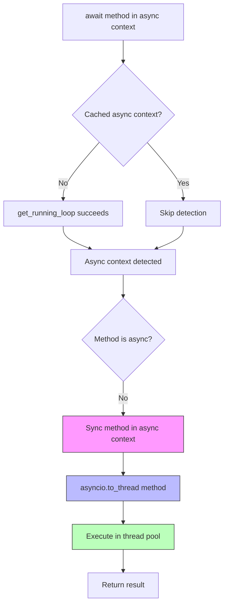
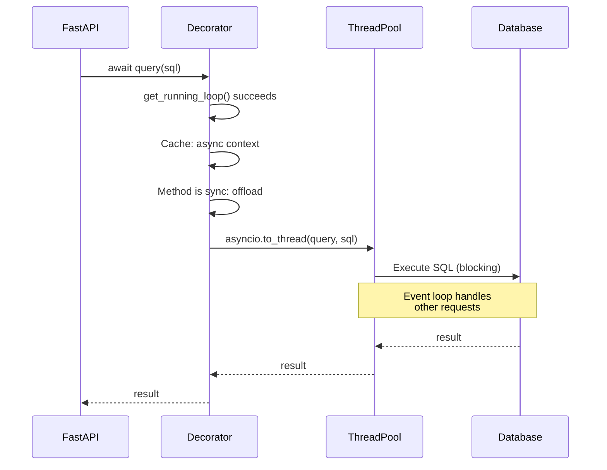

# How It Works: Async → Sync

**Scenario**: Calling sync code from async context (event loop running).

**Use case**: FastAPI/Django apps using legacy sync libraries (sqlite3, psycopg2).

---

## Overview

When you call a sync method from async context, SmartAsync:
1. Detects event loop is running
2. Offloads sync method to thread pool with `asyncio.to_thread()`
3. Returns awaitable that yields result when thread completes
4. Event loop remains unblocked

**Critical**: Without thread offloading, sync I/O would block the entire event loop!

---

## Execution Flow



---

## Step-by-Step

### 1. User awaits method in async context

```python
@smartasync
def query_database(sql: str):
    # Sync blocking I/O
    conn = sqlite3.connect("app.db")
    cursor = conn.cursor()
    cursor.execute(sql)
    return cursor.fetchall()

# Async context (FastAPI)
@app.get("/users")
async def get_users():
    # Must await - returns coroutine
    users = await query_database("SELECT * FROM users")
    return {"users": users}
```

### 2. Decorator detects async context

```python
try:
    loop = asyncio.get_running_loop()
    # Success - we're in async context
    _cached_has_loop = True
except RuntimeError:
    # Would raise if sync context
    pass
```

### 3. Pattern match: (True, False)

```python
match (async_context, async_method):
    case (True, False):  # Async context + Sync method
        # Offload to thread - don't block event loop!
        return asyncio.to_thread(method, self, *args, **kwargs)
```

### 4. Execute in thread pool

```python
# asyncio.to_thread() internally:
# 1. Gets default thread pool executor
# 2. Submits callable to executor
# 3. Returns awaitable Future
# 4. Caller awaits Future result
```

### 5. User receives result

```python
users = await query_database(sql)
# While thread executes, event loop handles other requests
# Result available when thread completes
```

---

## Complete Example

```python
from smartasync import smartasync
from fastapi import FastAPI
import sqlite3

class DatabaseManager:
    def __init__(self, db_path: str):
        self.db_path = db_path

    @smartasync
    def query(self, sql: str, params: tuple = ()):
        """Sync method - but async-safe!"""
        conn = sqlite3.connect(self.db_path)
        conn.row_factory = sqlite3.Row
        cursor = conn.cursor()
        try:
            cursor.execute(sql, params)
            return [dict(row) for row in cursor.fetchall()]
        finally:
            conn.close()

app = FastAPI()
db = DatabaseManager("app.db")

@app.get("/users")
async def get_users():
    # Sync database call - automatically threaded!
    users = await db.query("SELECT * FROM users")
    return {"users": users}

@app.get("/users/{user_id}")
async def get_user(user_id: int):
    # Event loop not blocked by database I/O
    users = await db.query(
        "SELECT * FROM users WHERE id = ?",
        (user_id,)
    )
    return {"user": users[0] if users else None}
```

---

## What Happens Internally



---

## Why Thread Offloading?

### Without threading (WRONG!)

```python
@app.get("/users")
async def get_users():
    # ❌ BAD: Blocks entire event loop!
    conn = sqlite3.connect("app.db")  # Blocking I/O
    cursor = conn.cursor()
    cursor.execute("SELECT * FROM users")  # Blocking I/O
    # ALL other requests frozen until query completes!
```

### With SmartAsync threading (CORRECT!)

```python
@app.get("/users")
async def get_users():
    # ✅ GOOD: Automatically threaded
    users = await db.query("SELECT * FROM users")
    # Event loop free to handle other requests
```

---

## Performance

| Operation | Time | Notes |
|-----------|------|-------|
| Context detection (first) | ~2μs | Check for event loop |
| Context detection (cached) | ~0μs | Skipped |
| Thread offload overhead | ~50-100μs | Thread pool submission |
| Database query | ~1-10ms | Actual work |
| **Total overhead** | **~0.5-10%** | Acceptable for I/O |

**Key point**: ~50-100μs thread overhead is negligible compared to I/O operations.

---

## Thread Safety Considerations

### Connection per request (recommended)

```python
@smartasync
def query(self, sql: str):
    # Create connection per call
    conn = sqlite3.connect(self.db_path)
    try:
        # ... query ...
    finally:
        conn.close()  # Always cleanup
```

### Connection pooling (advanced)

```python
from queue import Queue

class PooledDB:
    def __init__(self, db_path: str, pool_size: int = 5):
        self.pool = Queue(maxsize=pool_size)
        for _ in range(pool_size):
            conn = sqlite3.connect(db_path, check_same_thread=False)
            self.pool.put(conn)

    @smartasync
    def query(self, sql: str):
        conn = self.pool.get()
        try:
            # ... query ...
        finally:
            self.pool.put(conn)
```

---

## Edge Cases

### Sync method called from sync context

```python
# CLI tool (sync context)
db = DatabaseManager("app.db")
users = db.query("SELECT * FROM users")  # Works! No await needed
```

SmartAsync detects sync context and calls method directly (no threading).

### Exception propagation

```python
@smartasync
def buggy_query():
    raise ValueError("SQL error!")

@app.get("/test")
async def test():
    try:
        result = await buggy_query()
    except ValueError:
        return {"error": "Caught!"}  # Works normally
```

---

## Comparison with Manual Threading

### Manual approach (verbose)

```python
@app.get("/users")
async def get_users():
    # Manual threading - boilerplate!
    loop = asyncio.get_event_loop()
    result = await loop.run_in_executor(
        None,  # Default executor
        lambda: db.query_sync("SELECT * FROM users")
    )
    return {"users": result}
```

### SmartAsync approach (clean)

```python
@app.get("/users")
async def get_users():
    # Automatic threading!
    users = await db.query("SELECT * FROM users")
    return {"users": users}
```

---

## Key Points

✅ **Non-blocking**: Event loop never blocked by sync I/O
✅ **Automatic**: No manual `run_in_executor()` needed
✅ **Transparent**: Same code works in sync and async contexts
⚠️ **Thread overhead**: ~50-100μs per call (acceptable for I/O)
⚠️ **Thread pool**: Uses default executor (configurable via asyncio)

---

## Related

- [Sync → Async](sync-to-async.md) - Opposite direction
- [Scenario 02](../scenarios/02-async-app-sync-libs.md) - Practical examples
- [BIDIRECTIONAL-IMPLEMENTATION.md](../../BIDIRECTIONAL-IMPLEMENTATION.md) - Design decisions
