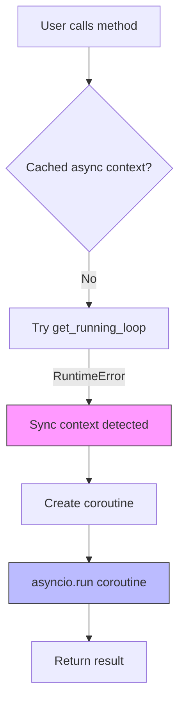
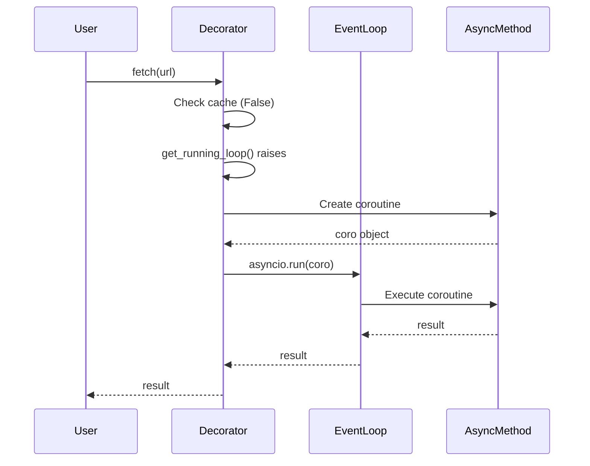

# How It Works: Sync → Async

**Scenario**: Calling async code from sync context (no event loop running).

**Use case**: CLI tools, scripts, legacy applications using modern async libraries.

---

## Overview

When you call an async method from sync context, SmartAsync:
1. Detects no event loop is running
2. Creates a coroutine from the async method
3. Executes it with `asyncio.run()`
4. Returns the result directly

---

## Execution Flow



---

## Step-by-Step

### 1. User calls method (no await)

```python
@smartasync
async def fetch(url: str):
    async with httpx.AsyncClient() as client:
        return await client.get(url).json()

# Sync context
data = fetch("https://api.example.com")  # No await
```

### 2. Decorator detects context

```python
try:
    asyncio.get_running_loop()  # Raises RuntimeError
except RuntimeError:
    # We're in sync context
    pass
```

### 3. Pattern match: (False, True)

```python
match (async_context, async_method):
    case (False, True):  # Sync context + Async method
        coro = method(self, *args, **kwargs)
        return asyncio.run(coro)  # Execute and return result
```

### 4. Execute with asyncio.run()

```python
# asyncio.run() internally:
# 1. Creates new event loop
# 2. Runs coroutine to completion
# 3. Closes loop
# 4. Returns result
```

### 5. User receives result

```python
data = fetch(url)  # Receives dict, not coroutine
print(data["key"])  # Direct access
```

---

## Complete Example

```python
from smartasync import smartasync
import httpx

class GitHubClient:
    @smartasync
    async def get_repo(self, owner: str, repo: str):
        async with httpx.AsyncClient() as client:
            response = await client.get(
                f"https://api.github.com/repos/{owner}/{repo}"
            )
            return response.json()

# Sync usage (CLI tool)
def main():
    client = GitHubClient()

    # No await needed - SmartAsync handles it
    data = client.get_repo("python", "cpython")

    print(f"Stars: {data['stargazers_count']}")
    print(f"Forks: {data['forks_count']}")

if __name__ == "__main__":
    main()
```

---

## What Happens Internally



---

## Performance

| Operation | Time | Notes |
|-----------|------|-------|
| Context detection | ~2μs | Check for event loop |
| asyncio.run() overhead | ~100μs | Create/destroy loop |
| Network request | ~10-200ms | Actual work |
| **Total overhead** | **~0.05-1%** | Negligible for I/O |

**Conclusion**: The ~100μs overhead is acceptable because:
- Only paid once per CLI invocation
- Dominated by network/disk I/O (ms scale)
- Alternative (persistent loop) adds complexity

---

## Edge Cases

### Nested asyncio.run() (forbidden)

```python
async def outer():
    # Inside async context - event loop running
    data = fetch(url)  # ❌ Would try to nest event loops!
```

**SmartAsync behavior**: Detects async context, returns coroutine instead.

### Exception propagation

```python
@smartasync
async def buggy():
    raise ValueError("Error!")

# Sync context
try:
    result = buggy()  # Exception raised during asyncio.run()
except ValueError:
    print("Caught!")  # Works normally
```

---

## Key Points

✅ **Automatic**: No `asyncio.run()` boilerplate needed
✅ **Transparent**: Exceptions propagate normally
✅ **Simple**: User doesn't need to know about event loops
⚠️ **Overhead**: ~100μs per call (acceptable for I/O operations)

---

## Related

- [Async → Sync](async-to-sync.md) - Opposite direction
- [Scenario 01](../scenarios/01-sync-app-async-libs.md) - Practical examples
